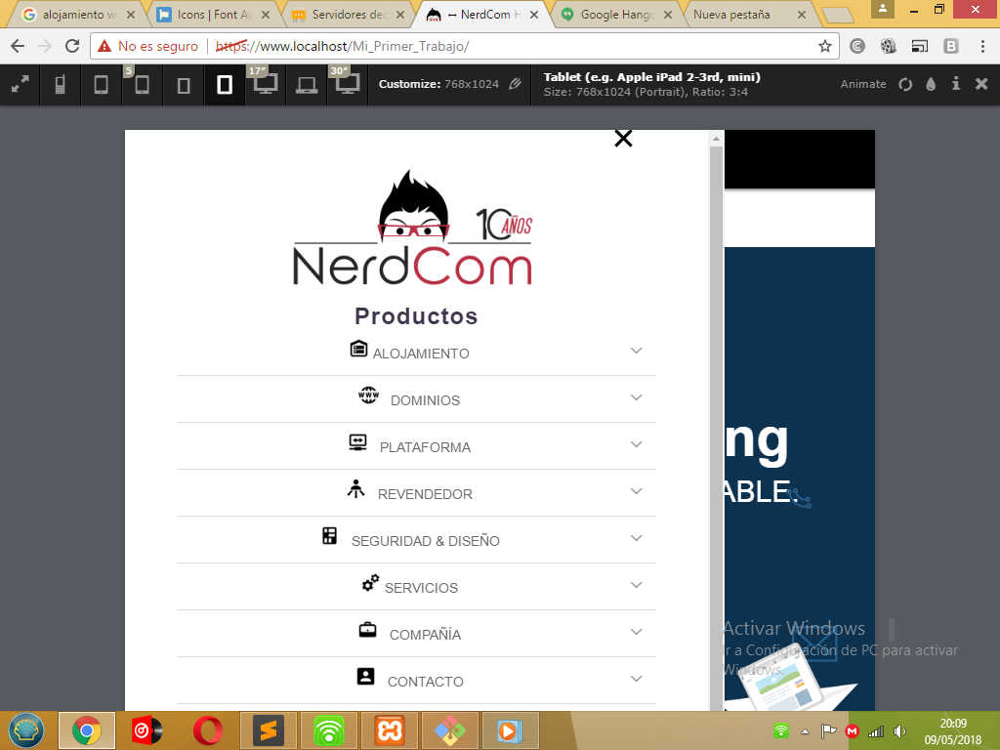
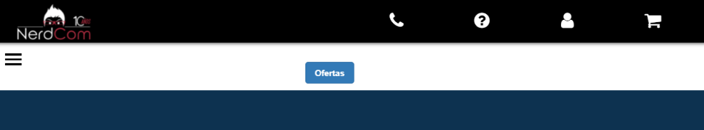
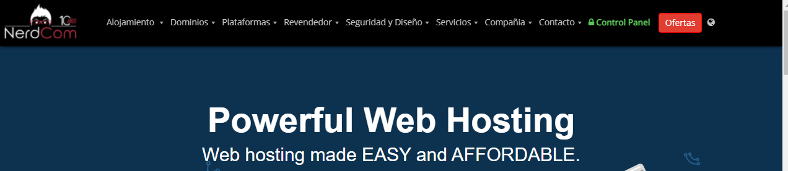
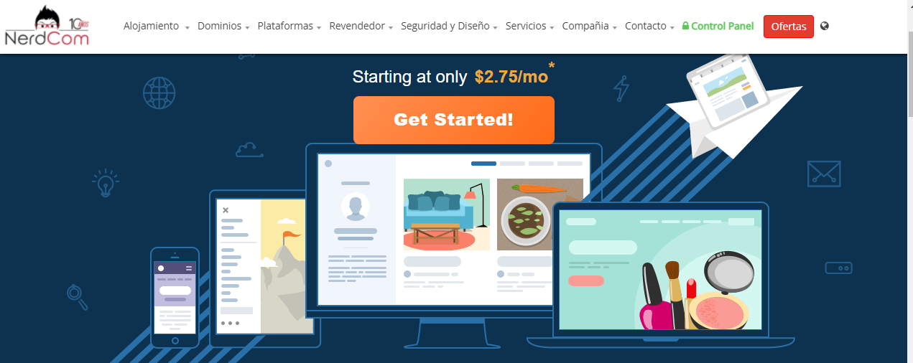

# NerdCom ⚡️

### My First Freelance Job

## Tasks performed 📋

✔️ improve css styling.\
✔️ Remove embedded CSS.\
✔️ Add media query to website.\
✔️ Improve a hamburger menu for medium and small screens.
   

     

     

     

     

